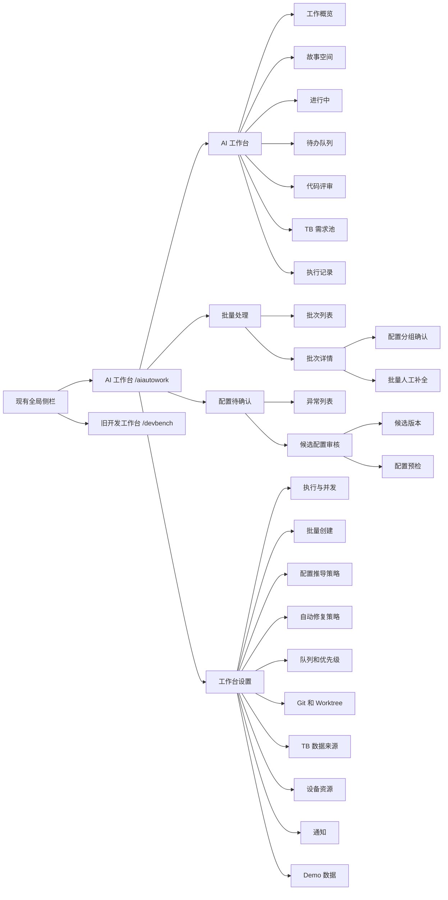
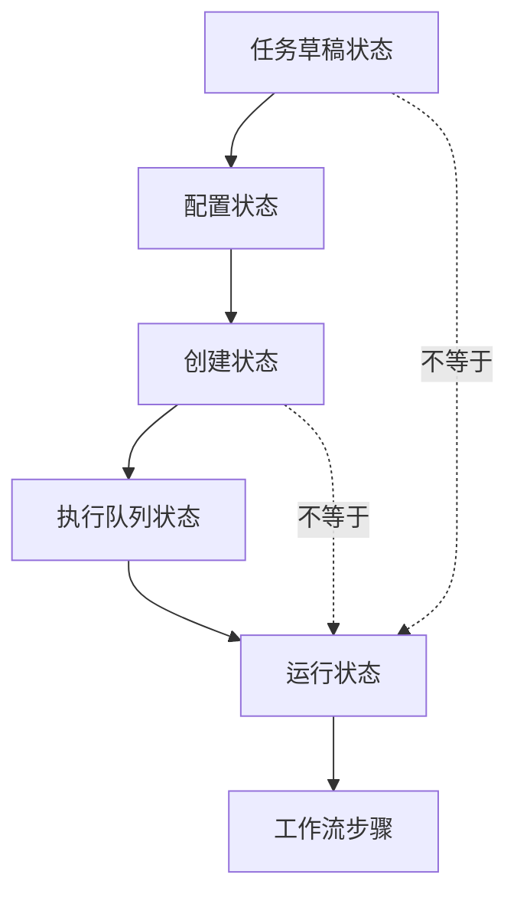

# 信息架构

## 方案比较

### 方案 A：单页十多个一级 Tab

结构：概览、故事点、进行中、待办、Review、TB、批量、待确认、记录、设置全部放在同一条 Tab。

优点：

- 首次实现简单。
- 页面切换成本低。

缺点：

- 一级入口会持续膨胀。
- “对象类型”和“处理阶段”混在一起。
- 批量详情、设置和配置待确认都需要复杂子页面，Tab 无法表达层级。
- 1366px 宽度下会拥挤或横向滚动。

### 方案 B：四个一级产品域 + 工作台二级视图（采用）

一级：

1. AI 工作台
2. 批量处理
3. 配置待确认
4. 工作台设置

AI 工作台二级：

1. 工作概览
2. 故事空间
3. 进行中
4. 待办队列
5. 代码评审
6. TB 需求池
7. 执行记录

优点：

- 一级按用户目标划分，长期可扩展。
- 批量和配置待确认拥有独立工作区。
- 保留故事空间，不让 DevBench 会话 Tab 消失。
- 设置与日常工作分离。
- 适配现有全局侧栏，可在正式实现时将 AI 工作台作为一个聚合入口。

缺点：

- 需要域内导航和面包屑。
- 原型状态管理稍复杂。

选择理由：复杂度来自“任务生命周期”，不是来源数量。四个一级域能让用户快速判断自己是在调度、批处理、纠错还是设置。

## 产品信息架构

## 路由关系

| 路由 | 用途 |
|---|---|
| `/aiautowork` | 工作概览 |
| `/aiautowork?view=story-space` | 故事空间 |
| `/aiautowork?view=running` | 进行中 |
| `/aiautowork?view=todo` | 待办队列 |
| `/aiautowork?view=reviews` | 代码评审 |
| `/aiautowork?view=tb-pool` | TB 需求池 |
| `/aiautowork?view=records` | 执行记录 |
| `/aiautowork/batches` | 批量处理中心 |
| `/aiautowork/batches/:batchId` | 批次详情 |
| `/aiautowork/config-confirm` | 配置待确认 |
| `/aiautowork/settings` | 工作台设置 |
| `/devbench` | 旧单故事点开发工作台 |

Mock Demo 使用查询参数模拟路由，不接入正式 Router。

## 导航规范

- 全局只新增一个“AI 工作台”入口。
- 工作台域内使用 216px 左侧一级导航。
- AI 工作台页面使用横向二级 Tab。
- 批次详情和配置审核使用面包屑，不增加一级入口。
- “打开旧开发工作台”放在顶部工具区，视觉为次要按钮。
- Demo 场景切换放在顶部右侧，仅原型可见。

## 状态分层

- 任务草稿：识别和配置是否完成。
- 创建状态：故事点实体是否创建。
- 执行队列：是否等待执行槽位。
- 运行状态：AI/Worker 是否正在执行。
- 工作流步骤：执行内部进行到哪一环节。

