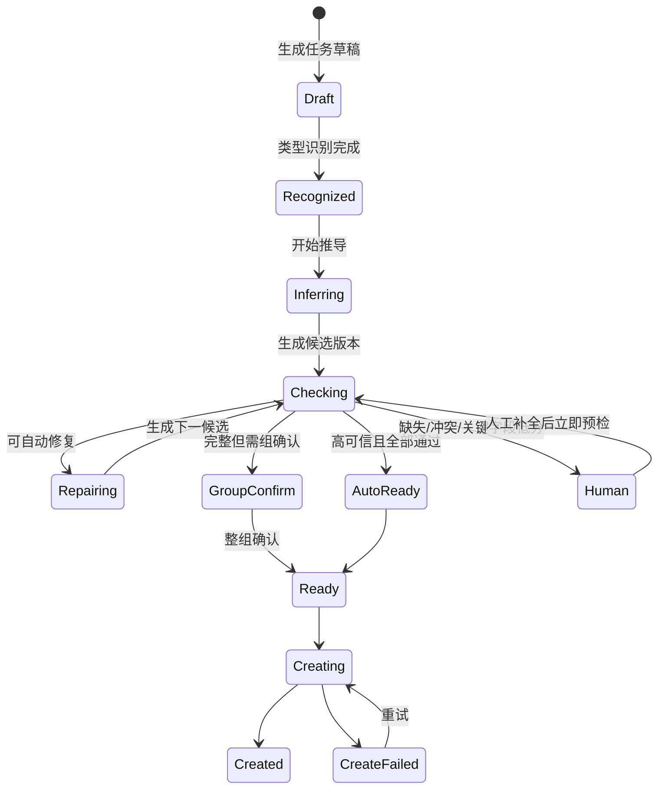
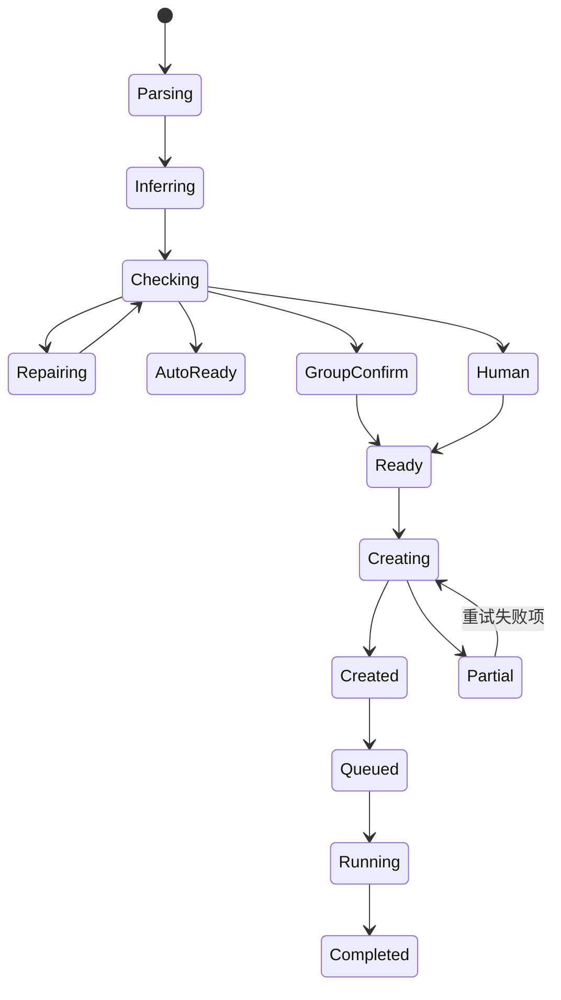

# 状态矩阵

## Task Draft 状态

| 状态 | 视觉 | 主操作 | 是否可创建 |
|---|---|---|---|
| 待识别 | 灰 + 文档图标 | 开始识别 | 否 |
| 已识别 | 蓝灰 + 类型图标 | 开始推导 | 否 |
| 等待 AI 推导 | Cyan 灰化 | 调整优先级 | 否 |
| AI 推导中 | Cyan + 进度图标 | 暂停 | 否 |
| 自检中 | Cyan + 校验图标 | 查看进度 | 否 |
| 自动修复中 | Cyan + 版本号 | 暂停修复 | 否 |
| 自动通过 | Green + 勾选 | 查看配置 | 是 |
| 建议批量确认 | Amber + 组图标 | 按组确认 | 否 |
| 需要人工介入 | Amber/Red + 人员图标 | 处理配置 | 否 |
| 配置预检失败 | Red + 阻断图标 | 修复问题 | 否 |
| 已就绪 | Green + 就绪图标 | 创建 | 是 |
| 创建中 | Blue + 进度图标 | 查看进度 | 否 |
| 已创建 | Green + Story ID | 查看故事点 | 已完成 |
| 创建失败 | Red + 错误图标 | 重试 | 可重试 |

## 配置字段状态

| 状态 | 说明 | 自动更新 |
|---|---|---|
| AI 推荐 | 候选值，尚未采用 | 可被新候选替换 |
| 已采纳 | AI 值进入最终配置 | 可被用户修改 |
| 用户手动选择 | 用户选择值 | 不自动覆盖 |
| 用户覆盖 AI | 最终值与 AI 不同 | 不自动覆盖 |
| 缺失 | 必填值为空 | 自动修复可补 |
| 冲突 | 值与明确输入或映射冲突 | 必须解决 |
| 无效 | 元数据不存在 | 必须解决 |
| 已锁定 | 用户确认并锁定 | 禁止自动覆盖 |

## 运行状态与工作流

| 运行状态 | 工作流示例 | 可用操作 |
|---|---|---|
| 排队中 | 收集信息 | 调整优先级、取消 |
| 运行中 | 修改代码 | 查看详情、暂停 |
| 等待人工 | 配置推导/测试 | 处理配置/确认 |
| 已暂停 | 任意 | 继续、取消 |
| 已阻塞 | 读取工程/编译 | 查看阻断、重试 |
| 执行失败 | 任意 | 查看错误、重新执行 |
| 已完成 | 生成报告 | 查看报告、再次执行 |

运行状态和工作流必须显示在两个独立列。

## 配置预检

| 结果 | 说明 | 是否继续 |
|---|---|---|
| 通过 | 必填和确定性规则全部通过 | 可以 |
| 警告 | 有风险但可人工接受 | 确认后可以 |
| 阻断 | 缺字段、值无效或冲突 | 不可以 |

## 候选版本

| 版本 | 综合评分 | 最低关键分 | 阻断 | 结果 |
|---|---:|---:|---:|---|
| V1 | 78 | 42 | 1 | 历史最佳，分支缺失 |
| V2 | 74 | 38 | 1 | 错误删除依赖 |
| V3 | 76 | 40 | 1 | 分支仍冲突 |

系统选择 V1，进入人工补充分支。

## 批次状态

## Demo 场景状态

| 场景 | 关键变化 |
|---|---|
| 正常运行 | 3/5 执行，少量异常 |
| 并发已满 | 5/5，停止启动新任务 |
| 大量排队 | 排队 95 |
| 100 条批量推导 | 批次进度动态 |
| 自动修复成功 | V2 修复后通过 |
| 自动修复失败 | V1–V3 均失败 |
| 多个等待人工 | 待确认数提升 |
| 多个配置冲突 | 阻断列表优先 |
| Review Critical | Critical Findings 红色置顶 |
| TB 数据源异常 | 部分来源加载失败 |
| 全部完成 | 运行和排队为 0 |
| 空数据 | 展示引导型空状态 |
