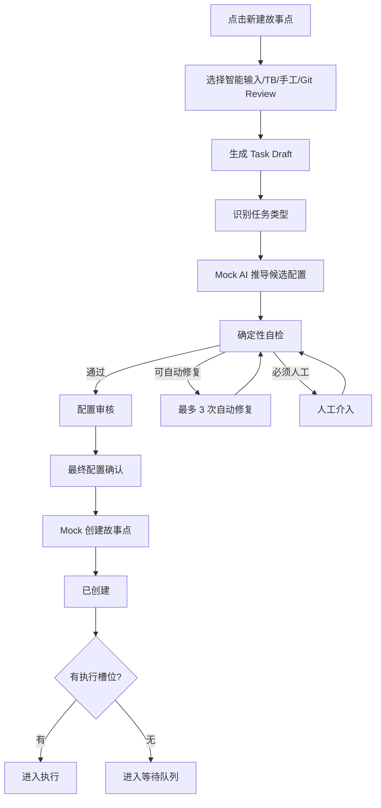
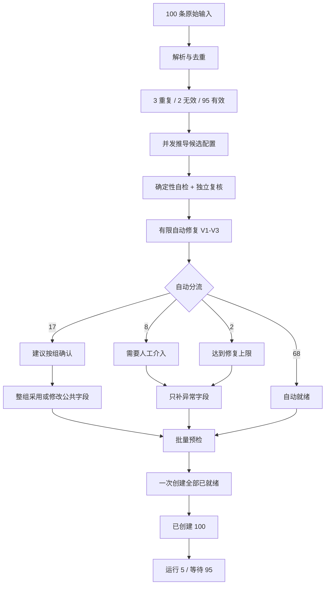
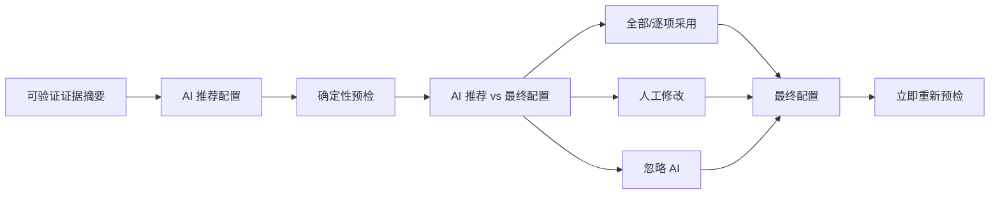
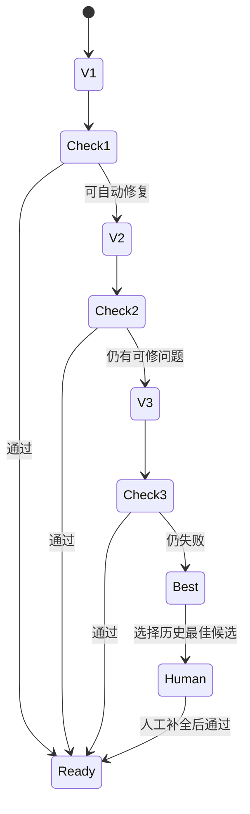
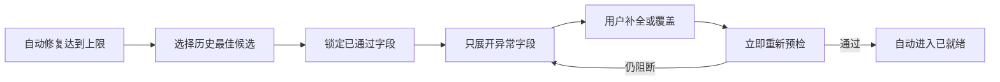
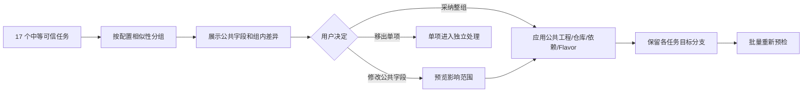
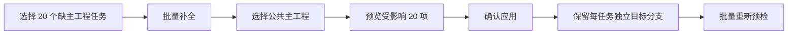
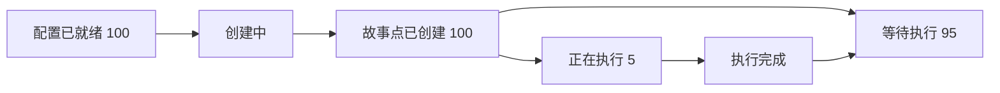

# 核心用户流程

## 单个任务创建

## 智能混合输入

1. 用户粘贴多行内容。
2. UI 逐行生成草稿，不立即显示“已创建”。
3. 识别 TB、MANUAL、GIT_REVIEW。
4. 展示有效、重复、无效、已存在故事点和可创建数量。
5. 单条进入创建向导；多条进入批量处理中心。

## 100 条批量创建

## 配置推导与确认

证据只展示来源摘要，不展示模型内部思维链。

## 自动修复

每个版本记录评分、关键字段最低分、阻断、警告、修改字段和修复原因。回滚表示恢复候选配置，不是 Git 回滚。

## 人工介入

1. 自动选择历史最佳候选并预填已通过字段。
2. 页面只展开异常字段。
3. 展示候选值、历史成功值、问题原因和自动修复历史。
4. 用户补全后立即 Mock 预检。
5. 通过后自动变为已就绪，不要求返回列表再次确认。

## 配置分组确认

## 批量补全

公共字段、独立字段、继承字段和单项覆盖字段必须在预览中明确区分。

## 创建与执行队列

降低并发不会终止当前运行任务，只阻止新任务启动。
